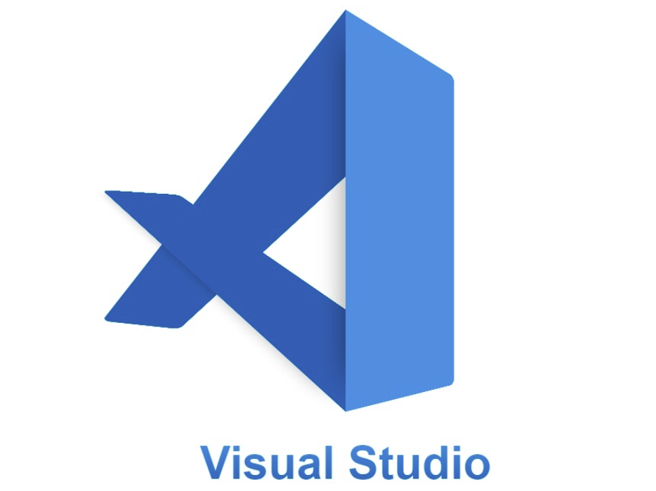

# Visual Studio Code
## Visual Studio Code es un editor de código fuente desarrollado por Microsoft para Windows, Linux, macOS. Incluye soporte para la depuración, control integrado de Git, resaltado de sintaxis, finalización inteligente de código, fragmentos y refactorización de código. Es gratuito y de código abierto,​ aunque la descarga oficial está bajo software privativo e incluye características personalizadas por Microsoft.

# ¿Quieres Aumentar Tu Productividad?
## Con más del 70 % de los desarrolladores que usan vscode, es el entorno de codificación más popular, desde el desarrollo web hasta la ciencia de datos.

## Y aunque vscode tiene una sólida gama de características fuera de la caja, su poder oculto radica en el ecosistema de extensiones de vscode que puedes descargar e instalar desde el mercado.

## ***¡Piensa en esto como una tienda de aplicaciones para extensiones de vscode!***

## Las extensiones de vscode cubren una amplia gama de funcionalidades útiles para mejorar su experiencia de dev.

| EXTENSIONES | Por |
|-----:|---------------|
| Better Comments | Aaron Bond |
| Indent-rainbow | Oderwat |
| One Dark Pro | Binaryify |
| Peacock | John Papa |
| Prettier Code Formatter | Prettier |
| Symbols | Miguel Solorio |
| Python | Microsoft |

# 10 Buenas practicas para mejorar tu código

| Rank | Mejora tu código |
|-----:|---------------|
|     1| ***Usa nombres descriptivos*** |
|     2| ***Divide el código en funciones pequeñas*** |
|     3| ***Reduce la complejidad*** |
|     4| ***Comenta tu código*** |
|     5| ***Separa la lógica del diseño*** |
|     6| ***Haz pruebas unitarias*** |
|     7| ***Utiliza el principio "Keep It Simple"*** |
|     8| ***Sigue las convenciones de codificación*** |
|     9| ***Evita la repetición del código*** |
|     10| ***Revisa y refactoriza el código*** |

##### ***Nota: Las convenciones de programación son un conjunto de directrices para un lenguaje de programación concreto que recomienda estilo, prácticas, y métodos de programación para cada aspecto de un programa escrito en cada lenguaje***

|  | Descripción |
|-----:|---------------|
|  | ***Documentación oficial*** |
|  | ***Python Básico 02*** |

# Puedes seguir y apoyar mi trabajo haciendo click en "☆ Star" y en el botón de Follow.
# ¡Muchas gracias, bienvenido!!!

# Contacto y apoyo:

 

 

