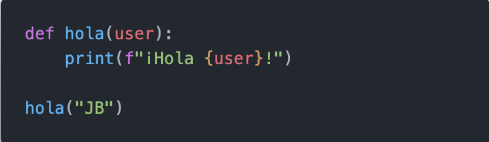

# ***Python***

## ***¿Que es Python?***
* Es un lenguaje de programación con una sintaxis limpia.

## ***Características:***
* Lenguaje interpretado
* Tipado dinámico
* Fuerte tipado
* Multiplataforma
* Orientada a objetos

## ***Comentarios***
### Un comentario en programación es la línea de texto en nuestro código fuente que el compilador ignora.
### Los comentarios en programación se utilizan para poner aclaraciones del código, y así es más fácil de entender lo que hace, aunque también se utilizan para anular parte de un código.

### En la imagen podemos ver diferentes formas de hacer un comentario en este caso en particular se identifica con el símbolo de ' # ', mientras en comentario de varias lineas se identifica con ' """ '; estos símbolos dependerán del lenguaje de programación que utilicemos.

## ***Indentación***
### La indentación en Python hace referencia a los espacios en blanco que están en el lado izquierdo de cada línea de código. Lo usamos para definir bloques de código. Las líneas que estén indentadas al mismo nivel pertenecen al mismo bloque de código. Esto genera un código limpio y fácil de leer.

### En la imagen podemos identificar 2 bloques en el código; el primer bloque corresponde cuando definimos una función ' hola '; el segundo bloque corresponde cuando llamamos a la función ' hola '.

|  | Descripción |
|-----:|---------------|
|  | ***Documentación oficial*** |
|  | ***Python Básico 03*** |

## Puedes seguir y apoyar mi trabajo haciendo click en "☆ Star" y en el botón de Follow.
## ¡Muchas gracias, bienvenido!!!

## Contacto y apoyo:

 
 

