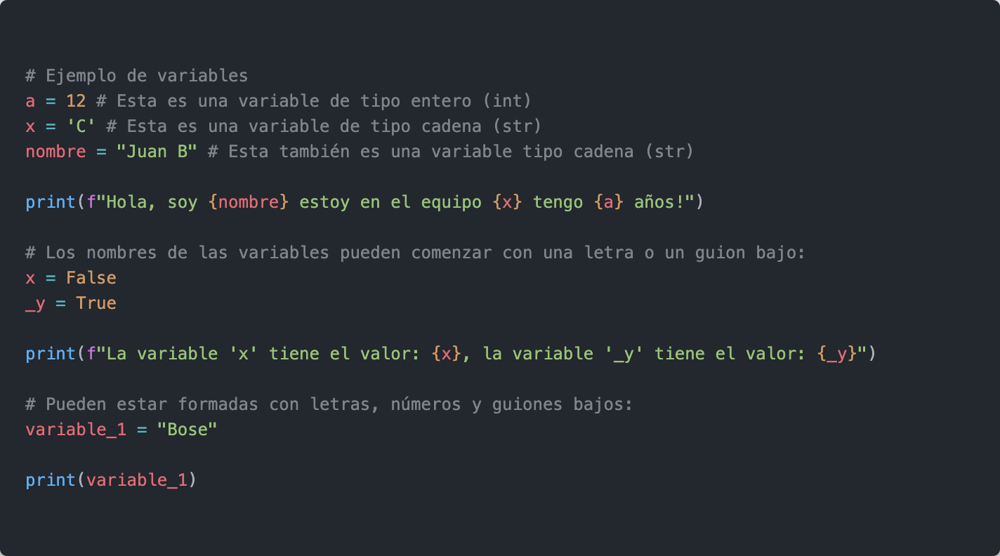
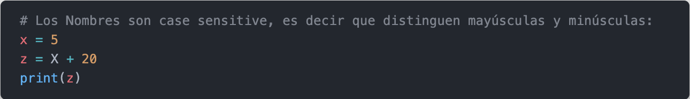
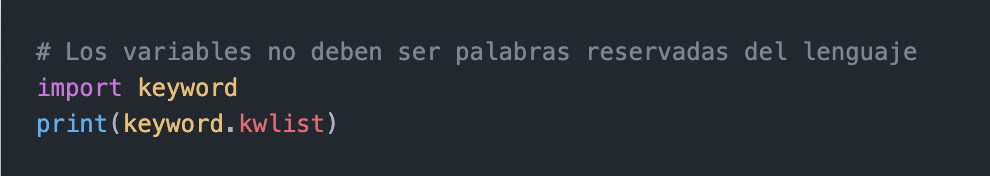

# ***Variables***

### Las variables, nos permiten guardar valores, con el fin de reutilizarlos en diferentes partes del código.
### Para crear una variable en python debes especificar el nombre de la variable y luego asignarle un valor

> [!IMPORTANT]
> ***Recuerda las buenas practicas***
>+ ***Utilizar nombres descriptivos***

## Estructura de una variable:
+ <"variable"> =  <"valor">

### ***Ejemplo de variables:***

> [!WARNING]
> En este caso tendremos como respuesta un error:
> NameError: name 'X' is not defined. Did you mean: 'x'? 

> [!CAUTION]
>No podemos utilizar palabras reservadas.
>Estas son las palabras reservadas:
>['False', 'None', 'True', 'and', 'as', 'assert', 'async', 'await', 'break', 'class', 'continue', 'def', 'del', 'elif', 'else', 'except', 'finally', 'for', 'from', 'global', 'if', 'import', 'in', 'is', 'lambda', 'nonlocal', 'not', 'or', 'pass', 'raise', 'return', 'try', 'while', 'with', 'yield']

|  | Descripción |
|-----:|---------------|
|  | ***Documentación oficial*** |
|  | ***Python Básico 04*** |

## Puedes seguir y apoyar mi trabajo haciendo click en "☆ Star" y en el botón de Follow.
## ¡Muchas gracias, bienvenido!!!

## Contacto y apoyo:

 
 

