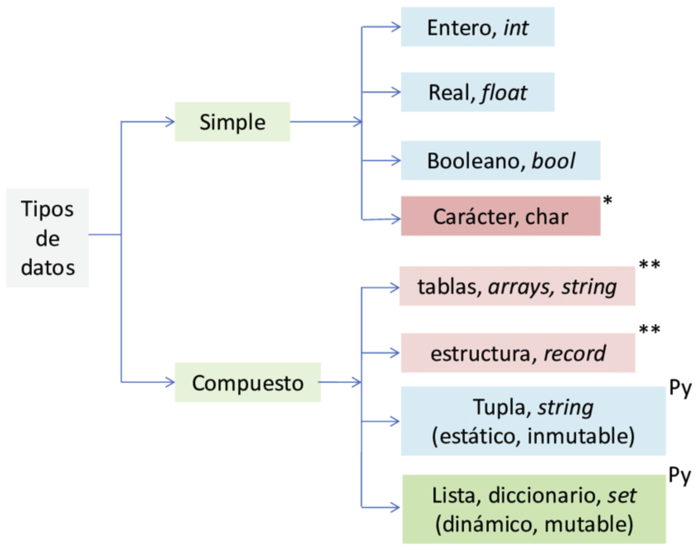
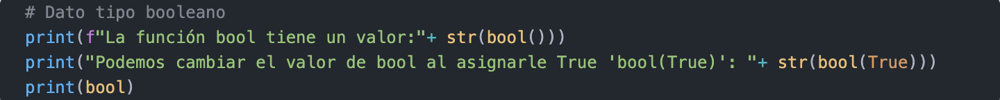
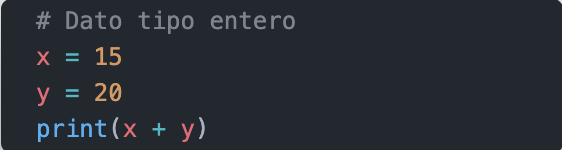
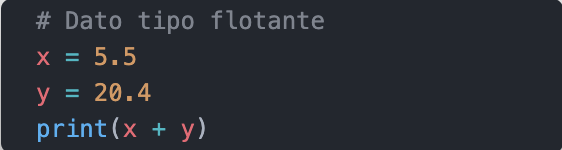
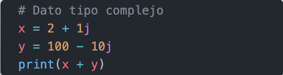
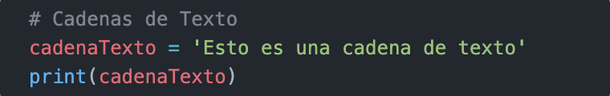
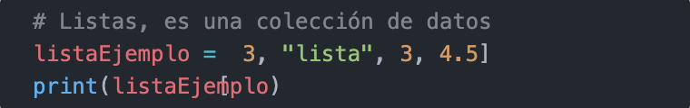
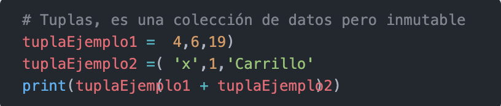
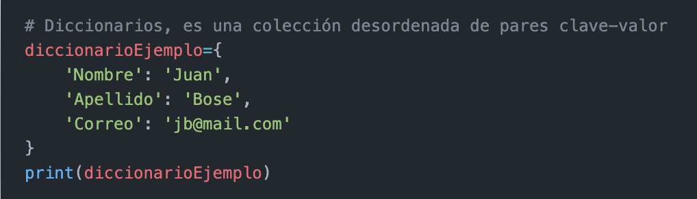
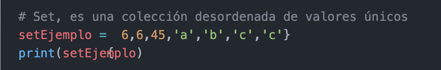

# ***Tipos de datos***

#### ***Tipos de datos. +El tipo de dato carácter no existe en Python, un carácter simple se representa como cadena de caracteres (string). ++ Estructuras compuestas de lenguajes como C, FORTRAN, Pascal, Matlab, etc. Py: Estructuras compuestas en Python. Fuente: elaboración propia.***

## ***bool()***
### La función bool(), es un constructor, el cual crea un tipo de datos booleanos, devuelve un tipo booleano True cuando el argumento dado es True, de lo contrario False.

## ***Enteros***
### Los números enteros son aquellos que no tienen decimales, tanto positivos como negativos (además del cero). En Python se pueden representar mediante el tipo int (de integer, entero).

## ***Coma flotante***

### Los números reales son los que tienen decimales. En Python se expresan mediante el tipo float. En otros lenguajes de programación, como C, tiene también el tipo double, similar a float pero de mayor precisión (double = doble precisión).

## ***Complejos***
### La mayor parte de lenguajes de programación carecen de este tipo, aunque sea muy utilizado por ingenieros y científicos en general.

### En el caso de que necesite utilizar números complejos, o simplemente tiene curiosidad, este tipo, llamado complex en Python, también se almacena usando coma flotante, debido a que estos números son una extensión de los números reales.

## ***Tipo cadenas de caracteres***
### Las cadenas de caracteres, son secuencias inmutables que contienen caracteres encerrado entre comillas. Son caracteres encerrado entre comillas simples (') o dobles (").

## ***Listas***

### En Python tiene varios tipos de datos compuestos y dentro de las secuencias, están los tipos de cadenas de caracteres. Otro tipo muy importante de secuencia son las listas.

### Entre las secuencias, el más versátil, es la lista, para definir una, usted debe escribir es entre corchetes, separando sus elementos con comas cada uno.

### La lista en Python son variables que almacenan arrays, internamente cada posición puede ser un tipo de datos distinto.

## ***Tuplas***

### Las tuplas son objetos de tipo secuencia, específicamente es un tipo de dato lista inmutable. Esta no puede modificarse de ningún modo después de su creación.

## ***Diccionarios***

### El diccionario, define una relación uno a uno entre claves y valores.

## ***Conjuntos (set)***

### Un conjunto, es una colección no ordenada y sin elementos repetidos. Los usos básicos de éstos incluyen verificación de pertenencia y eliminación de entradas duplicadas.

#
|  | Descripción |
|-----:|---------------|
|  | ***Documentación oficial*** |
|  | ***Python Básico 05*** |

## Puedes seguir y apoyar mi trabajo haciendo click en "☆ Star" y en el botón de Follow.
## ¡Muchas gracias, bienvenido!!!

## Contacto y apoyo:

 
 

