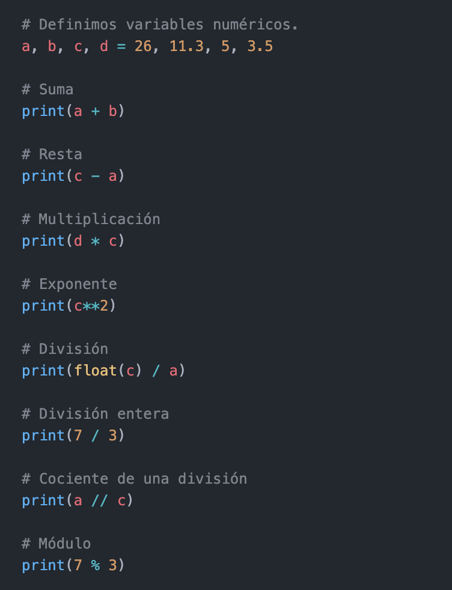
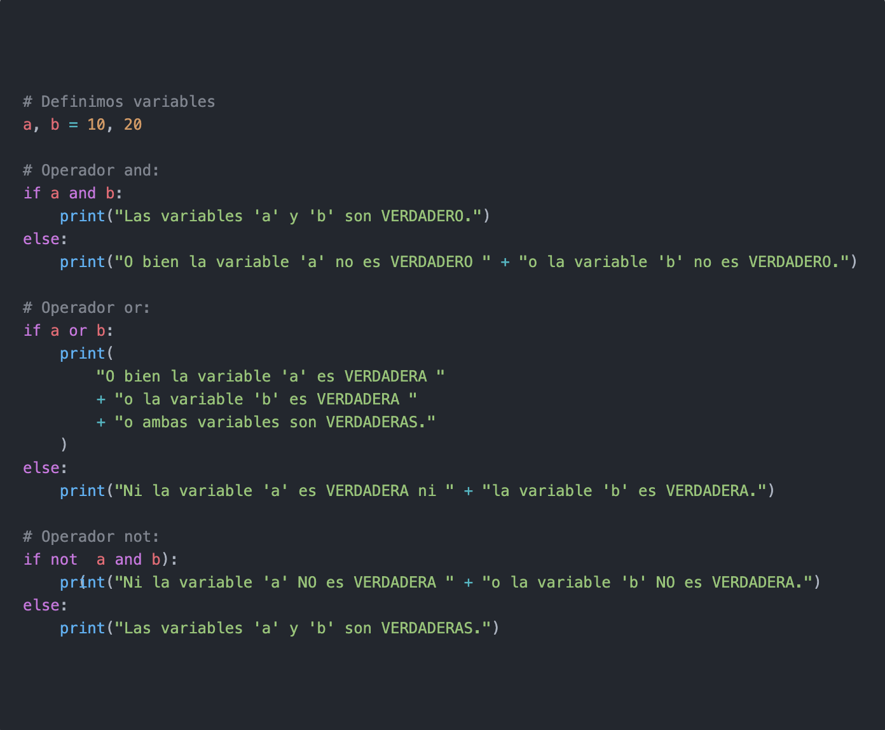
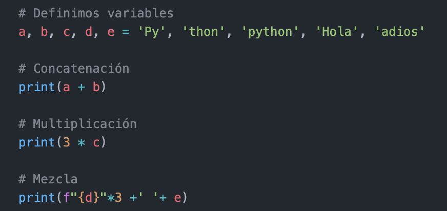

# Operadores Matemáticos

# ***Orden de precedencia***

## El orden de precedencia de ejecución de los operadores aritméticos es:
### 1- Exponente: **
### 2- Negación: -
### 3- Multiplicación, División, División entera, Módulo: *, /, //, %
### 4- Suma, Resta: +, -

# Ejemplos:

## ***Operadores lógicos***

### Estos son los distintos tipos de operadores con los que puede trabajar con valores booleanos, los llamados operadores lógicos o condicionales:

# ***Operador and***
### El operador ***and*** evalúa si el valor del lado izquierdo y el lado derecho se cumple.

# ***Operador or***
### El operador ***or*** evalúa si el valor del lado izquierdo o el lado derecho se cumple.

# ***Operador not***
### El operador ***not*** devuelve el valor opuesto la valor booleano.

# Ejemplos:

# Operaciones con Cadenas
### Concatenación: Dos o más cadenas literales una al lado son concatenadas

# Multiplicación  
### Podemos multiplicar una misma cadena

#
|  | Descripción |
|-----:|---------------|
|  | ***Documentación oficial*** |
|  | ***Python Básico 06*** |

## Puedes seguir y apoyar mi trabajo haciendo click en "☆ Star" y en el botón de Follow.
## ¡Muchas gracias, bienvenido!!!

## Contacto y apoyo:

 
 

