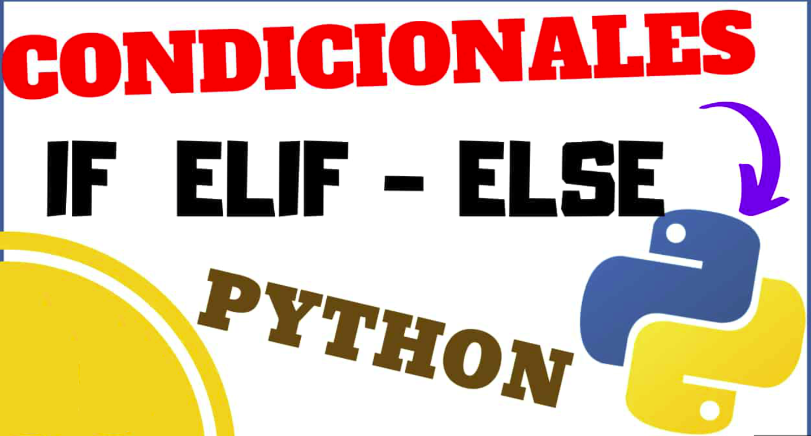
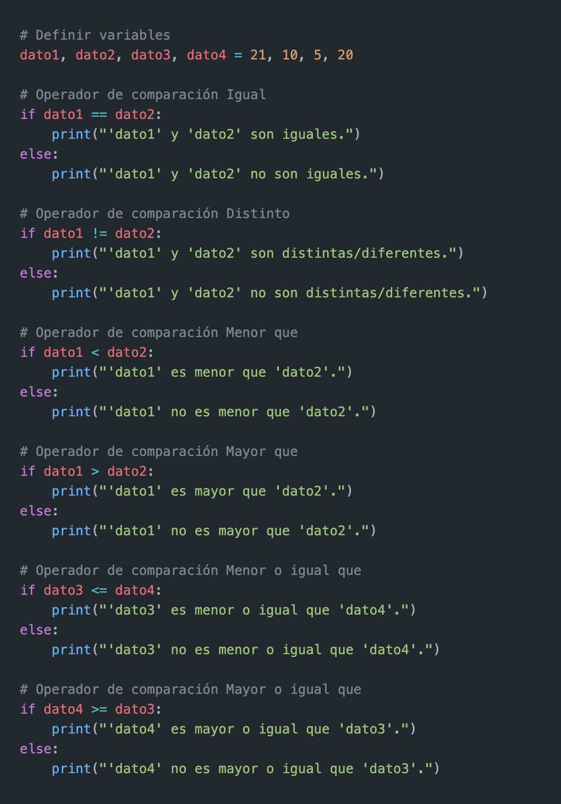

# Condicionales ***if, elif, else***

## ***Condicional if***
- La sentencia condicional if se usa para tomar decisiones, este evalúa básicamente una operación lógica, es decir una expresión que de como resultado True o False, y ejecuta la pieza de código siguiente siempre y cuando el resultado sea verdadero.

## ***Sentencia if***
- La sentencia if EXPRESION, significa, Si se cumple la expresión condicional se ejecuta el bloque de sentencias seguidas.

## ***Sentencia elif***
- La sentencia elif EXPRESION, significa, De lo contrario Si se cumple la expresión condicional se ejecuta el bloque de sentencias seguidas.

## ***Sentencia else***
- La sentencia else, significa, De lo contrario se cumple sin evaluar ninguna expresión condicional y ejecuta el bloque de sentencias seguidas.

# ***Expresiones condicionales***
## ***Expresión ==***
### Esta expresión usa el operador == para validar la misma.
- El operador == evalúa que los valores sean iguales para varios tipos de datos.

## ***Expresión is***
### Esta expresión usa el operador is para validar la misma.
- El operador is, significa, que prueba identidad: ambos lados de la expresión condicional debe ser el mismo objecto

## ***Expresión in***
### Esta expresión usa el operador in para validar la misma.
- El operador in, significa, para cualquier colección del valor del lado izquierdo contenga el valor del lado derecho

#
|  | Descripción |
|-----:|---------------|
|  | ***Documentación oficial*** |
|  | ***Python Básico 07*** |

## Puedes seguir y apoyar mi trabajo haciendo click en "☆ Star" y en el botón de Follow.
## ¡Muchas gracias, bienvenido!!!

## Contacto y apoyo:

 

 

