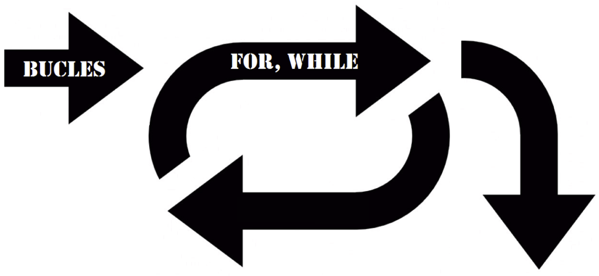
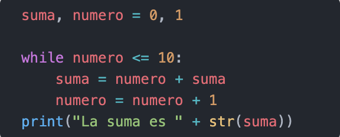
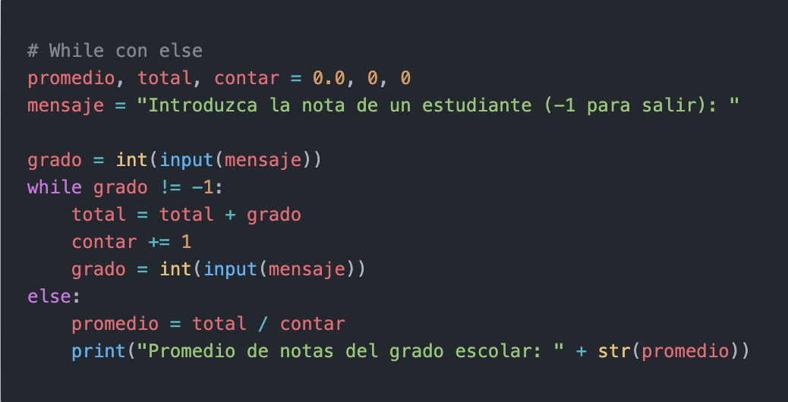
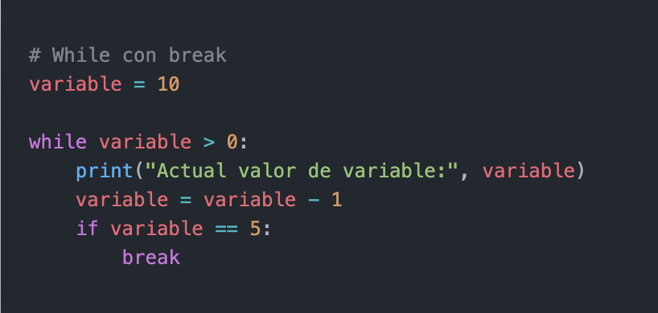
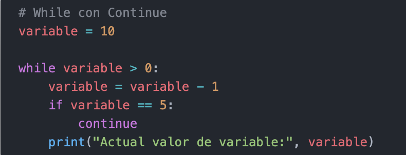
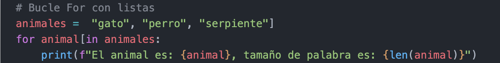
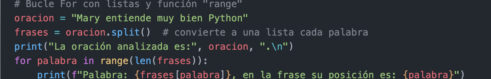
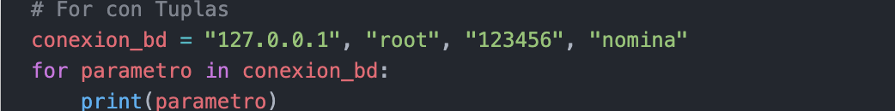
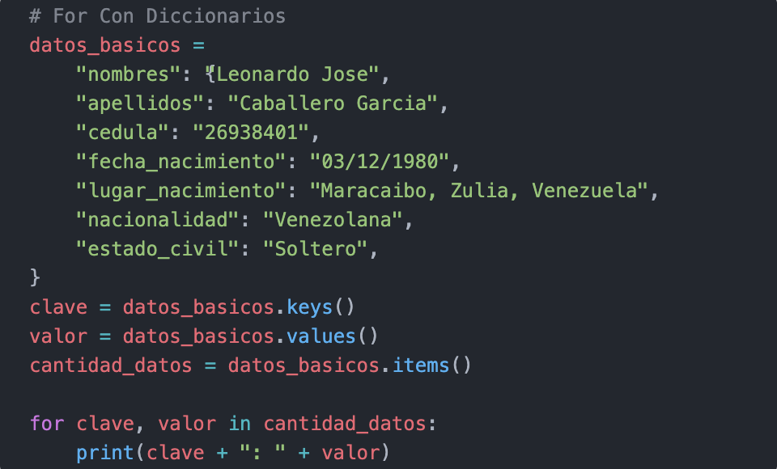
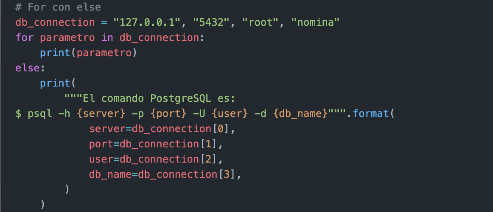

# Bucles ***While & For***

## ***Bucle while***

### En Python tiene una palabra reservada llamada while que nos permite ejecutar ciclos, o bien secuencias periódicas que nos permiten ejecutar código múltiples veces.

### El ciclo while nos permite realizar múltiples iteraciones basándonos en el resultado de una expresión lógica que puede tener como resultado un valor True o False.

## Tipos de Bucle “while”
### Bucle “while” controlado por Conteo

### En este ejemplo tiene un contador con un valor inicial de cero, cada iteración del while manipula esta variable de manera que incremente su valor en 1, por lo que después de su primera iteración el contador tendrá un valor de 1, luego 2, y así sucesivamente.

### Eventualmente cuando el contador llegue a tener un valor de 10, la condición del ciclo numero <= 10 sera False, por lo que el ciclo terminará arrojando el siguiente resultado:

- La suma es 55

## Bucle “while” con ***“else”***

### Al igual que la sentencia if, la estructura while también puede combinarse con una sentencia else.

### El nombre de la sentencia else es equivocada, ya que el bloque else se ejecutará en todos los casos, es decir, cuando la expresión condicional del while sea False, (a comparación de la sentencia if).
### La sentencia else tiene la ventaja de mantener el mismo nombre y la misma sintaxis que en las demás estructuras de control.

### Salida:

- Introduzca la nota de un estudiante (-1 para salir): 10
- Introduzca la nota de un estudiante (-1 para salir): 6
- Introduzca la nota de un estudiante (-1 para salir): 9
- Introduzca la nota de un estudiante (-1 para salir): -1
- Promedio de notas del grado escolar: 8.333333333333334

## Sentencia ***break***

### Adicionalmente existe una forma alternativa de interrumpir o cortar los ciclos utilizando la palabra reservada break.

### Esta nos permite salir del ciclo incluso si la expresión evaluada en while (o en otro ciclo como for) permanece siendo True. Para comprender mejor use el mismo ejemplo anterior pero se interrumpe el ciclo usando la sentencia break.

### Salida:

- Actual valor de variable: 10
- Actual valor de variable: 9
- Actual valor de variable: 8
- Actual valor de variable: 7
- Actual valor de variable: 6

## Sentencia ***continue***
### La sentencia continue hace que pase de nuevo al principio del bucle aunque no se haya terminado de ejecutar el ciclo anterior.

### Salida:

- Actual valor de variable: 9
- Actual valor de variable: 8
- Actual valor de variable: 7
- Actual valor de variable: 6
- Actual valor de variable: 4
- Actual valor de variable: 3
- Actual valor de variable: 2
- Actual valor de variable: 1
- Actual valor de variable: 0

# Bucle ***For***

### La sentencia for en Python difiere un poco de lo que uno puede estar acostumbrado en lenguajes como C o Pascal. En lugar de siempre iterar sobre una progresión aritmética de números (como en Pascal) o darle al usuario la posibilidad de definir tanto el paso de la iteración como la condición de fin (como en C), la sentencia for de Python itera sobre los ítems de cualquier secuencia (una lista o una cadena de caracteres), en el orden que aparecen en la secuencia.

## Bucle “for” con Listas
### Uso del bucle for con tipos de estructuras de datos listas:

### Salida:
- El animal es: gato, tamaño de palabra es: 4
- El animal es: perro, tamaño de palabra es: 5
- El animal es: serpiente, tamaño de palabra es: 9

# Bucle “for” con Listas y función “range”
###  Uso del bucle for con tipos de estructuras de datos listas con la función range() y la función len():
### Si se necesita iterar sobre una secuencia de números. Genera una lista conteniendo progresiones aritméticos, por ejemplo, como se hace en el fragmento de código fuente anterior.

### Salida:
La oración analizada es: Mary entiende muy bien Python .
- Palabra: Mary, en la frase su posición es: 0
- Palabra: entiende, en la frase su posición es: 1
- Palabra: muy, en la frase su posición es: 2
- Palabra: bien, en la frase su posición es: 3
- Palabra: Python, en la frase su posición es: 4

# Bucle “for” con Tuplas
### A continuación, se presenta un ejemplo del uso del bucle for con tipos de estructuras de datos Tuplas:
### El ejemplo itera una tupla de parámetros.

### Salida:
- 127.0.0.1
- root
- 123456
- nomina

# Bucle “for” con Diccionarios

### A continuación, se presenta un ejemplo del uso del bucle for con tipos de estructuras de datos diccionarios:
### El ejemplo itera un diccionario con datos básicos de una persona.

# Salida:
- nombres: Leonardo Jose
- apellidos: Caballero Garcia
- cedula: 26938401
- fecha_nacimiento: 03/12/1980
- lugar_nacimiento: Maracaibo, Zulia, Venezuela
- nacionalidad: Venezolana
- estado_civil: Soltero

# Bucle “for” con “else”
### Al igual que la sentencia if y el bucle while, la estructura for también puede combinarse con una sentencia else.

### El nombre de la sentencia else es equivocada, ya que el bloque else se ejecutará en todos los casos, es decir, cuando la expresión condicional del bucle for sea False, (a comparación de la sentencia if).
### La sentencia else tiene la ventaja de mantener el mismo nombre y la misma sintaxis que en las demás estructuras de control.

# Salida
- 127.0.0.1
- 5432
- root
- nomina
- El comando PostgreSQL es:
- $ psql -h 127.0.0.1 -p 5432 -U root -d nomina

#
|  | Descripción |
|-----:|---------------|
|  | ***Documentación oficial*** |
|  | ***Python Básico 08*** |

## Puedes seguir y apoyar mi trabajo haciendo click en "☆ Star" y en el botón de Follow.
## ¡Muchas gracias, bienvenido!!!

## Contacto y apoyo:

 
 

