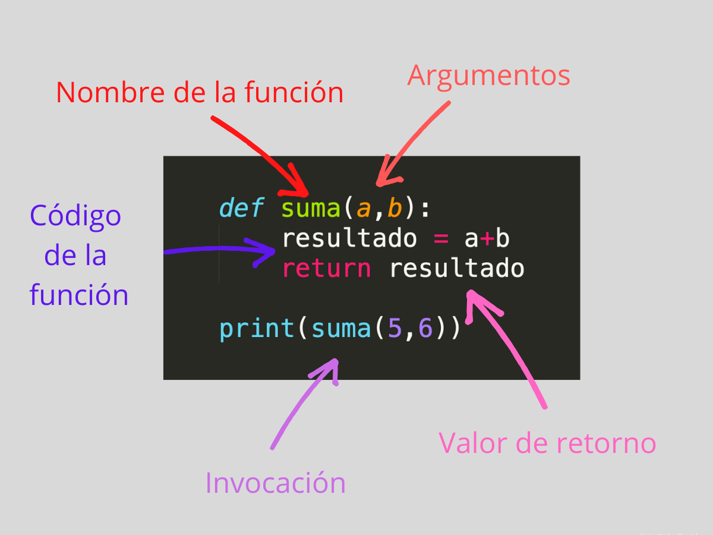
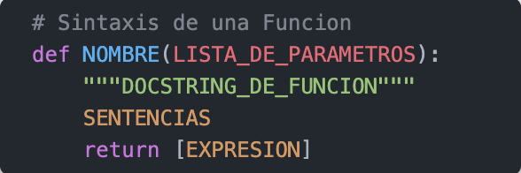
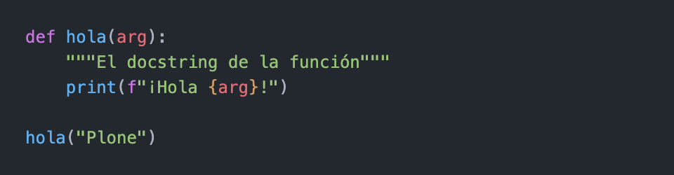

# ***Programación estructurada***

### La programación estructurada es un paradigma de programación basado en utilizar ***funciones*** o subrutinas, y únicamente tres estructuras de control:

- Secuencia: ejecución de una sentencia tras otra.
- Selección o condicional: ejecución de una sentencia o conjunto de sentencias, según el valor de una variable booleana.
- Iteración (ciclo o bucle): ejecución de una sentencia o conjunto de sentencias, mientras una variable booleana sea verdadera.

### Este paradigma se fundamenta en el teorema correspondiente, que establece que "toda función computable puede ser implementada en un lenguaje de programación que combine sólo estas tres estructuras lógicas o de control".

### La estructura de secuencia es la que se da naturalmente en el lenguaje, ya que por defecto las sentencias son ejecutadas en el orden en que aparecen escritas en el programa.

### Para las estructuras condicionales o de selección, Python dispone de la sentencia if, que puede combinarse con sentencias elif y/o else.

### Para los bucles o iteraciones existen las estructuras while y for.

# ***Funciones***
### Una función es un bloque de código con un nombre asociado, que recibe cero o más argumentos como entrada, sigue una secuencia de sentencias, la cuales ejecuta una operación deseada y devuelve un valor y/o realiza una tarea, este bloque puede ser llamados cuando se necesite.

### El uso de funciones es un componente muy importante del paradigma de la programación llamada estructurada, y tiene varias ventajas:
- modularización: permite segmentar un programa complejo en una serie de partes o módulos más simples, facilitando así la programación y el depurado.
- reutilización: permite reutilizar una misma función en distintos programas.

### Python dispone de una serie de funciones integradas al lenguaje, y también permite crear funciones definidas por el usuario para ser usadas en su propios programas.

# Sentencia ***def***

### La sentencia def es una definición de función usada para crear objetos funciones definidas por el usuario.

### Una definición de función es una sentencia ejecutable. Su ejecución enlaza el nombre de la función en el namespace local actual a un objecto función (un envoltorio alrededor del código ejecutable para la función). Este objeto función contiene una referencia al namespace local global como el namespace global para ser usado cuando la función es llamada.

### La definición de función no ejecuta el cuerpo de la función; esto es ejecutado solamente cuando la función es llamada.

### Significado de cada parte del pseudo código fuente anterior:
- NOMBRE, es el nombre de la función.
- LISTA_DE_PARAMETROS, es la lista de parámetros que puede recibir una función.
- DOCSTRING_DE_FUNCION, es la cadena de caracteres usada para documentar la función.
- SENTENCIAS, es el bloque de sentencias en código fuente Python que realizar cierta operación dada.
- return, es la sentencia return en código Python.
- EXPRESION, es la expresión o variable que devuelve la sentencia return.

# Ejemplo: 

# Salida: 
- ¡Hola Plone!

### La palabra reservada def se usa para definir funciones. Debe seguirle el nombre de la función en el ejemplo anterior hola() y la lista de parámetros formales entre paréntesis. Las sentencias que forman el cuerpo de la función empiezan en la línea siguiente, y deben estar indentado.

### La primer sentencia del cuerpo de la función puede ser opcionalmente una cadena de caracteres literal; esta es la cadena de caracteres de documentación de la función, o docstrings.

# Argumentos y parámetros

### Al definir una función los valores los cuales se reciben se denominan parámetros, pero durante la llamada los valores que se envían se denominan argumentos.

# Por posición

### Cuando envía argumentos a una función, estos se reciben por orden en los parámetros definidos. Se dice por tanto que son argumentos por posición:

#
|  | Descripción |
|-----:|---------------|
|  | ***Documentación oficial*** |
|  | ***Python Básico 09*** |

## Puedes seguir y apoyar mi trabajo haciendo click en "☆ Star" y en el botón de Follow.
## ¡Muchas gracias, bienvenido!!!

## Contacto y apoyo:

 
 

