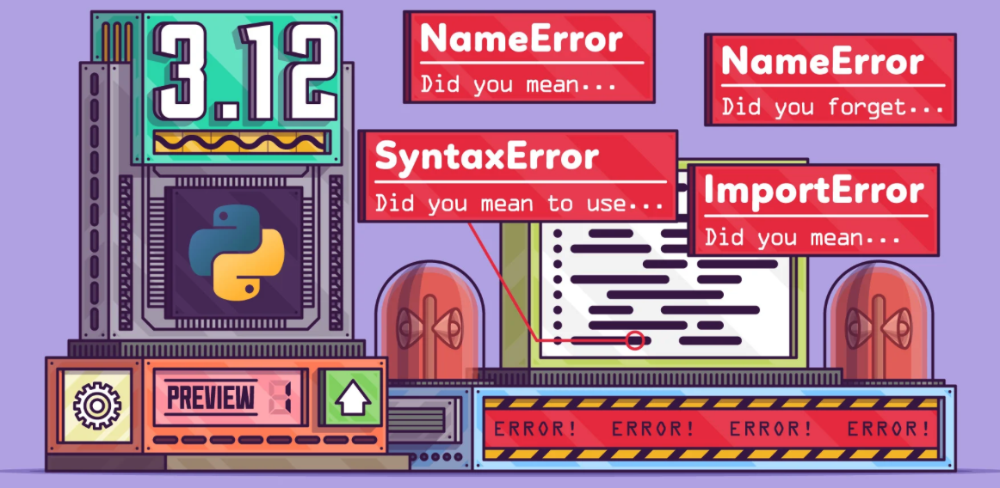
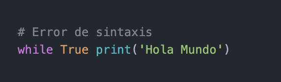
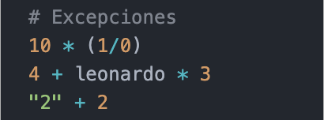
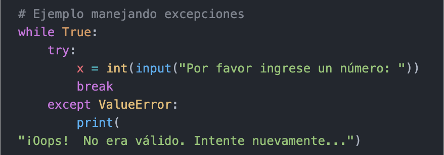

# Errores y excepciones

### Hay (al menos) dos tipos diferentes de errores: errores de sintaxis y excepciones.

# Errores de sintaxis

### Los errores de sintaxis, también conocidos como errores de interpretación, son quizás el tipo de queja más común que tienes cuando todavía estás aprendiendo Python:

### Salida:
-     File "/Users/juanlopez/Desktop/GitHub/Python_Basic/Python_NB/Python_NB09.py", line 2
-     while True print('Hola Mundo')
                 ^^^^^
        - SyntaxError: invalid syntax

### El intérprete repite la línea culpable y muestra una pequeña “flecha” que apunta al primer lugar donde se detectó el error. Este es causado por (o al menos detectado en) el símbolo que precede a la flecha: en el ejemplo, el error se detecta en la sentencia print, ya que faltan dos puntos (':') antes del mismo. Se muestran el nombre del archivo y el número de línea para que sepas dónde mirar en caso de que la entrada venga de un programa.

# Excepciones

### Incluso si la sentencia o expresión es sintácticamente correcta, puede generar un error cuando se intenta ejecutarla. Los errores detectados durante la ejecución se llaman excepciones, y no son incondicionalmente fatales. Sin embargo, la mayoría de las excepciones no son manejadas por los programas, y resultan en mensajes de error como los mostrados aquí:

### Salida:
-     10 * (1/0)
-     ZeroDivisionError: division by zero

-     4 + leonardo * 3
-     NameError: name 'leonardo' is not defined

-     "2" + 2
-     TypeError: can only concatenate str (not "int") to str

### La última línea de los mensajes de error indica qué sucedió. Las excepciones vienen de distintos tipos, y el tipo se imprime como parte del mensaje: los tipos en el ejemplo son: ZeroDivisionError, NameError y TypeError.

### La cadena mostrada como tipo de la excepción es el nombre de la excepción predefinida que ocurrió. Esto es verdad para todas las excepciones predefinidas del intérprete, pero no necesita ser verdad para excepciones definidas por el usuario (aunque es una convención útil). Los nombres de las excepciones estándar son identificadores incorporados al intérprete (no son palabras clave reservadas).

### El resto de la línea provee un detalle basado en el tipo de la excepción y qué la causó.

### La parte anterior del mensaje de error muestra el contexto donde la excepción sucedió, en la forma de un trazado del error listando líneas fuente; sin embargo, no mostrará líneas leídas desde la entrada estándar.

# Manejando excepciones

### Es posible escribir programas que manejen determinadas excepciones. El siguiente ejemplo, le pide al usuario una entrada hasta que ingrese un entero válido, pero permite al usuario interrumpir el programa (usando Control-C o lo que sea que el sistema operativo soporte); notá que una interrupción generada por el usuario se señaliza generando la excepción KeyboardInterrupt.

### La sentencia try funciona de la siguiente manera:

### - Primero, se ejecuta el bloque try (el código entre las sentencias try y except).

### - Si no ocurre ninguna excepción, el bloque except se saltea y termina la ejecución de la sentencia try.

### - Si ocurre una excepción durante la ejecución del bloque try, el resto del bloque se saltea. Luego, si su tipo coincide con la excepción nombrada luego de la palabra reservada except, se ejecuta el bloque except, y la ejecución continúa luego de la sentencia try.

### - Si ocurre una excepción que no coincide con la excepción nombrada en el except, esta se pasa a declaraciones try de más afuera; si no se encuentra nada que la maneje, es una excepción no manejada, y la ejecución se frena con un mensaje como los mostrados anteriormente.

# ¿Como funciona ***try***?

- Ejecuta el bloque try (entre try y except).
- Si no ocurre ninguna excepción, el bloque except se saltea y termina la ejecución de la declaración try.
- Si ocurre una excepción dentro del bloque try, el resto del bloque se saltea. Si el tipo de excepción corresponde con la nombrada luego de except, se ejecuta el bloque except, y la ejecución continua luego de la declaración try.
- La declaracion try puede tener mas de un except para manejar distintas excepciones.
- Las declaraciones try ... except tienen un bloque else opcional que que continua el except.

#
|  | Descripción |
|-----:|---------------|
|  | ***Documentación oficial*** |
|  | ***Python Básico 09*** |

## Puedes seguir y apoyar mi trabajo haciendo click en "☆ Star" y en el botón de Follow.
## ¡Muchas gracias, bienvenido!!!

## Contacto y apoyo:

 
 

