# ***Programación orientada a objetos***
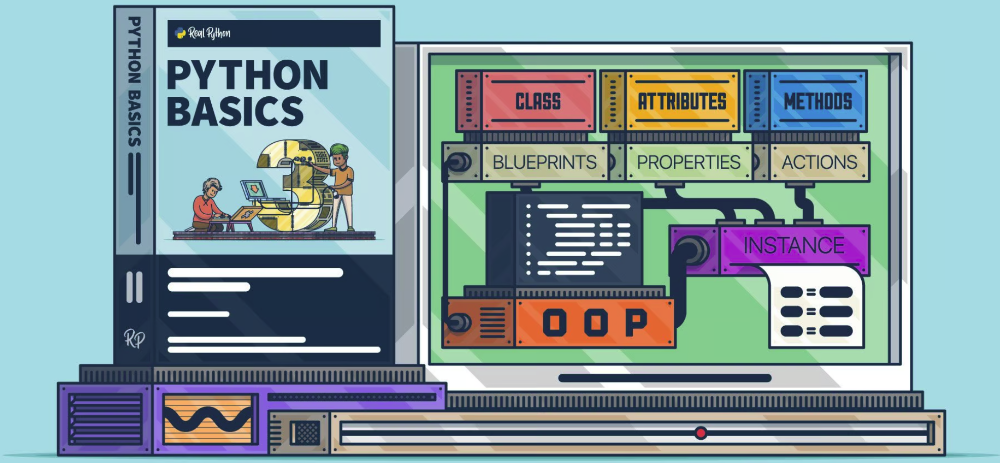

##### - ***Imagen de Real Python***

### La programación orientada a objetos (POO, u OOP según sus siglas en inglés) es un paradigma de programación que viene a innovar la forma de obtener resultados. Los objetos manipulan los datos de entrada para la obtención de datos de salida específicos, donde cada objeto ofrece una funcionalidad especial.

### Muchos de los objetos prediseñados de los lenguajes de programación actuales permiten la agrupación en bibliotecas o librerías, sin embargo, muchos de estos lenguajes permiten al usuario la creación de sus propias bibliotecas.

# POO en Python

### En Python las clases es una mezcla de los mecanismos de clase encontrados en C++ y Modula-3.

### Como es cierto para los módulos, las clases en Python no ponen una barrera absoluta entre la definición y el usuario, sino que más bien se apoya en la cortesía del usuario de no «forzar la definición».

### Se mantiene el poder completo de las características más importantes de las clases: el mecanismo de la herencia de clases permite múltiples clases base, una clase derivada puede sobrescribir cualquier método de su(s) clase(s) base, y un método puede llamar al método de la clase base con el mismo nombre.

    «Los objetos pueden tener una cantidad arbitraria de datos.»

### En terminología de C++, todos los miembros de las clases (incluyendo los miembros de datos), son públicos, y todas las funciones miembro son virtuales.

### Como en Modula-3, no hay atajos para hacer referencia a los miembros del objeto desde sus métodos: la función método se declara con un primer argumento explícito que representa al objeto, el cual se provee implícitamente por la llamada.

### Algunas particularidades de POO en Python son las siguientes:

- Todo es un objeto, incluyendo los tipos y clases.
- Permite herencia múltiple.
- No existen métodos ni atributos privados.
- Los atributos pueden ser modificados directamente.
- Permite «monkey patching».
- Permite «duck typing».
- Permite la sobrecarga de operadores.
- Permite la creación de nuevos tipos de datos.

# ***Objetos***

### Los objetos son abstracción de Python para data. Toda la data en un programa Python es representado por objectos o por relaciones entre objectos.

### Cada objeto tiene una identidad, un tipo y un valor. Una identidad de objecto nunca cambia una vez que es creada; usted puede pensar eso como la dirección de objeto en memoria. El operador in compara la identidad de dos objetos; la función id() devuelve un número entero representando la identidad (actualmente implementado como su dirección).

### El tipo de un objeto también es inmutable. El tipo de un objeto determina las operaciones que admite el objeto (por ejemplo, «¿tiene una longitud?») Y también define los valores posibles para los objetos de ese tipo. La función ***«type()»*** devuelve el tipo de un objeto (que es un objeto en sí mismo). El valor de algunos objetos puede cambiar. Se dice que los objetos cuyo valor puede cambiar son mutables; los objetos cuyo valor no se puede cambiar una vez que se crean se llaman immutable. La mutabilidad de un objeto está determinada por su tipo.

### Los objetos son la clave para entender la POO. Si mira a nuestro alrededor encontrará un sin fin de objetos de la vida real: perro, escritorio, televisor, bicicleta, etc…

### En Python puede definir una clase con la palabra reservada class, de la siguiente forma:

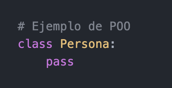

### Salida: 
- /usr/local/bin/python3 /Users/juanlopez/Desktop/GitHub/Python_Basic/Python_NB/Python_NB10.py

### En el ejemplo anterior, el nombre de la clase es Persona y dentro del bloque de código usa la sentencia pass. La sentencia pass no es requerido por el intérprete, los nombres de las clases se escriben por convención capitalizadas. Las clases pueden (y siempre deberían) tener comentarios.

##### Diagrama de Objeto Persona

# Atributos

### Los atributos o propiedades de los objetos son las características que puede tener un objeto, como el color. Si el objeto es Persona, los atributos podrían ser: cédula, nombre, apellido, sexo, etc…

### Los atributos describen el estado de un objeto. Pueden ser de cualquier tipo de dato.

### Salida:
- <class '__main__.Persona'>

### Puedes probar el código anterior, si lo transcribe en el consola interactiva Python como lo siguiente:

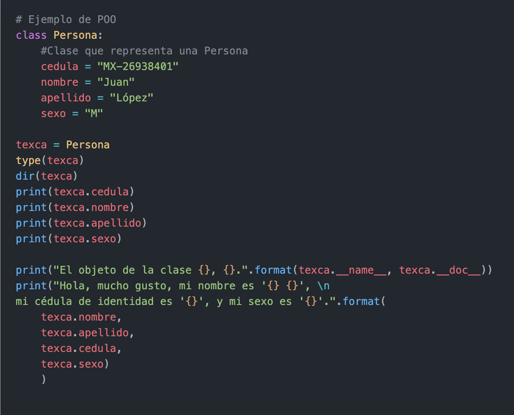

### Salida:
<class 'type'>
- ['__class__', '__delattr__', '__dict__', '__dir__', '__doc__', '__eq__', '__format__', '__ge__', '__getattribute__', '__gt__', '__hash__', '__init__', '__init_subclass__', '__le__', '__lt__', '__module__', '__ne__', '__new__', '__reduce__', '__reduce_ex__', '__repr__', '__setattr__', '__sizeof__', '__str__', '__subclasshook__', '__weakref__', 'apellido', 'cedula', 'nombre', 'sexo']
- MX-26938401
- Juan
- López
- M
- El objeto de la clase Persona, None.
- Hola, mucho gusto, mi nombre es 'Juan López', 
mi cédula de identidad es 'MX-26938401', y mi sexo es 'M'.

### Si el nombre de un atributo esta encerrado entre dobles guiones bajos son atributos especiales.

- ***_ _ _name_ _ _***, describe el nombre del objeto o del método.
- ***_ _ _doc_ _ _***, contiene la documentación de un módulo, una clase, o método especifico, escrita en el formato docstrings.

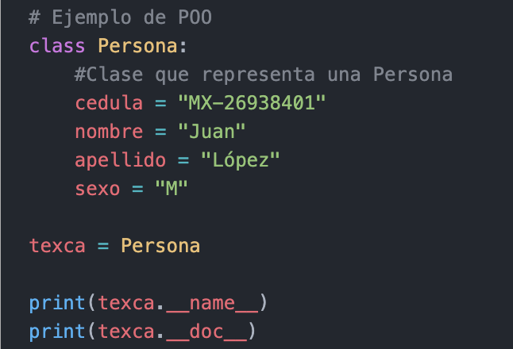

### Salida:
- Persona
- None

# Métodos

### Los métodos describen el comportamiento de los objetos de una clase. Estos representan las operaciones que se pueden realizar con los objetos de la clase,

### La ejecución de un método puede conducir a cambiar el estado del objeto.

### Se definen de la misma forma que las funciones normales pero deben declararse dentro de la clase y su primer argumento siempre referencia a la instancia que la llama, de esta forma se afirma que los métodos son funciones, adjuntadas a objectos.

### Si el objeto es Persona, los métodos pueden ser: hablar, caminar, comer, dormir, etc.
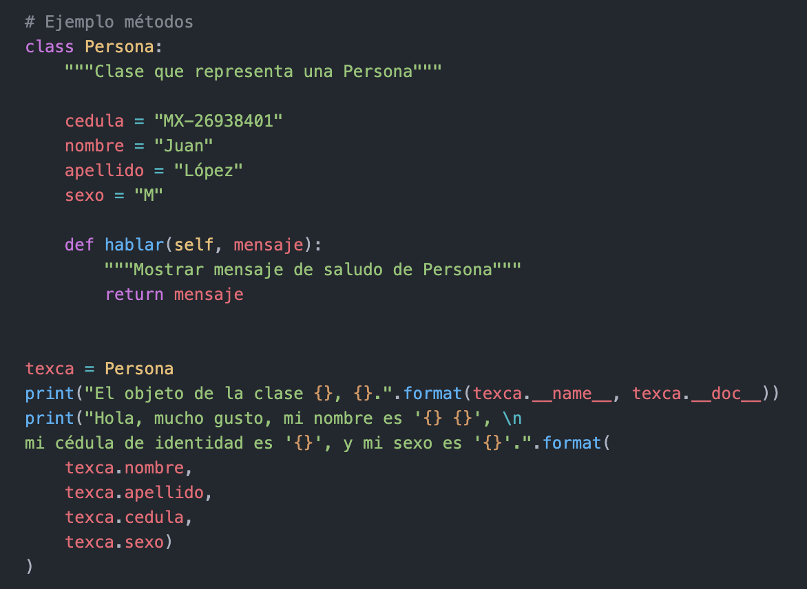

### Salida:
- El objeto de la clase Persona, Clase que representa una Persona.
- Hola, mucho gusto, mi nombre es 'Juan López', 
mi cédula de identidad es 'MX-26938401', y mi sexo es 'M'.

### La única diferencia sintáctica entre la definición de un método y la definición de una función es que el primer parámetro del método por convención debe ser el nombre ***self***.

### Puedes ejecutar el código de la siguiente forma:

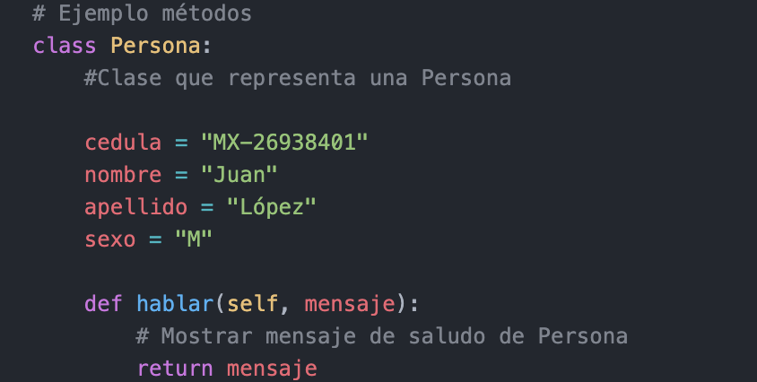

### Analizar la estructura de la clase el cual representa a una Persona:

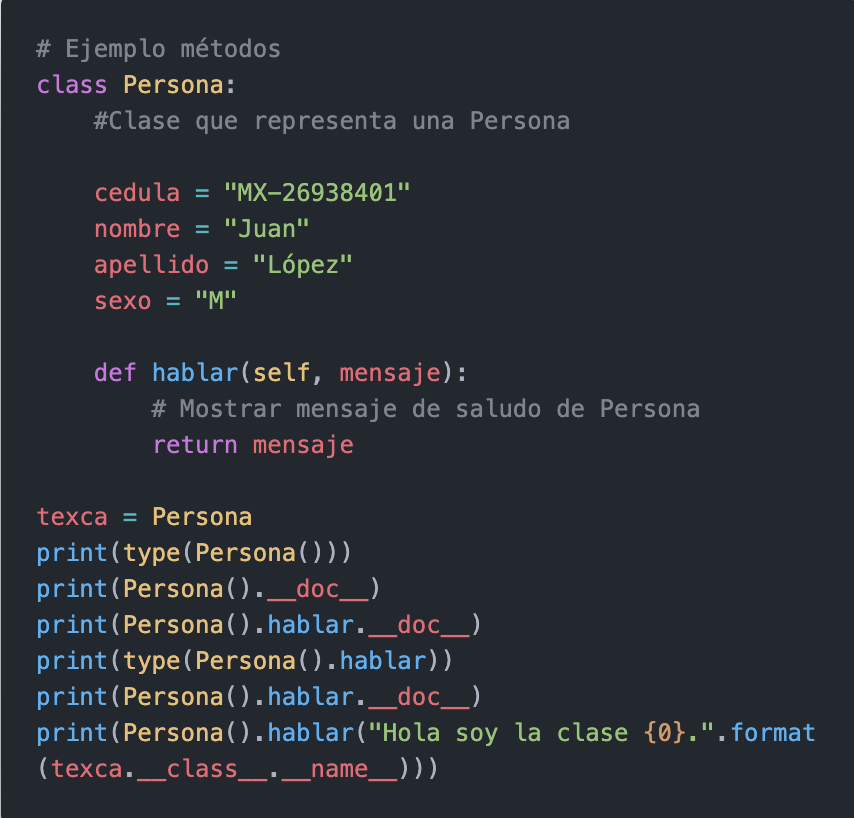

### Salida:
- <class '__main__.Persona'>
- None
- None
- <class 'method'>
- None
- Hola soy la clase type.

# Ámbito de los métodos

### Los métodos cuentan con un espacio de nombres propio. En caso de no encontrar un nombre en su ámbito local, buscará en el ámbito superior hasta encontrar alguna coincidencia.

### Los métodos pueden acceder y crear atributos dentro del objeto al que pertenecen, anteponiendo la palabra ***self*** y el operador de atributo ***«.»*** antes del nombre del atributo en cuestión.

# Métodos de clase
### En ocasiones es necesario contar con métodos que interactúen con elementos de la clase de la cual el objeto es instanciado. Python permite definir métodos de clase para esto.

### Los métodos de clase son aquellos que están ligados directamente con los atributos definidos en la clase que los contiene. Para definir un método de clase se utiliza el decorador ***@classmethod*** y por convención se utiliza cls como argumento inicial en lugar de self.

### Del mismo modo, los métodos de clase utilizan el prefijo cls para referirse a los atributos de la clase.

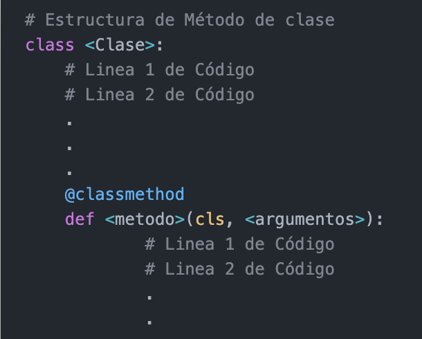

# Métodos estáticos

### Los métodos estáticos hacen referencia a las instancias y métodos de una clase. Para definir un método estático se utiliza el decorador @staticmethod y no utiliza ningún argumento inicial.

### Al no utilizar self, los métodos estáticos no pueden interactuar con los atributos y métodos de la instancia.

### Para referirse a los elementos de la clase, se debe utilizar el nombre de la clase como prefijo.

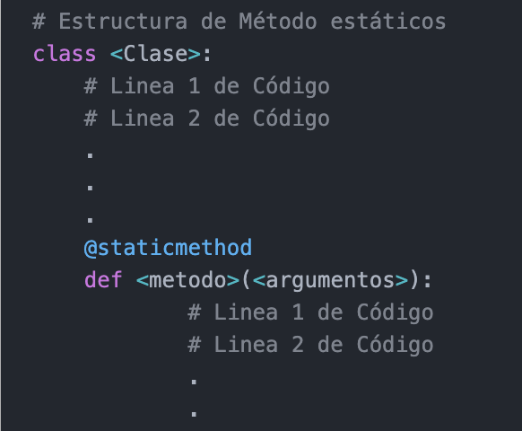

# Interfaces

### La forma en que los métodos de un objeto pueden ser accedidos por otros objetos se conoce como «interfaz». Una interfaz bien definida permite a objetos de distinta índole interactuar entre sí de forma modular. La interfaz define el modo en que los objetos intercambian información.

# Clases

### Las clases definen las características del objeto.

### Se puede decir que una clase es una plantilla genérica de un objeto. La clase proporciona variables iniciales de estado (donde se guardan los atributos) e implementaciones de comportamiento (métodos) necesarias para crear nuevos objetos, son los modelos sobre los cuáles serán construidos.

# Instancias

### Ya sabe que una clase es una estructura general del objeto. Por ejemplo, puede decir que la clase Persona necesita tener una cedula, un nombre, un apellido y una sexo, pero no va a decir cual es cedula, nombre, apellido y sexo, es aquí donde entran las instancias.

### Una instancia es una copia específica de la clase con todo su contenido

### Salida:
-       Traceback (most recent call last):
  -     File "/Users/juanlopez/Desktop/GitHub/Python_Basic/Python_NB/Python_NB10b.py", line 48, in <module>
    -       persona1 = Persona("MX-13458796", "Juan", "López", "M")
-       TypeError: Persona() takes no arguments

### La excepción ***TypeError*** indica que el método constructor no toma argumentos, esto se debe a que la momento de definir la clase a cada atributo se le asigno un valor (tipo de dato).

# Método ***_ _ init _ _ ()***

### El método _ _ _init_ _ _() es un método especial, el cual se ejecuta al momento de instanciar un objeto. El comportamiento de _ _ _init_ _ _() es muy similar a los «constructores» en otros lenguajes. Los argumentos que se utilizan en la definición de _ _ _init_ _ _() corresponden a los parámetros que se deben ingresar al instanciar un objeto.

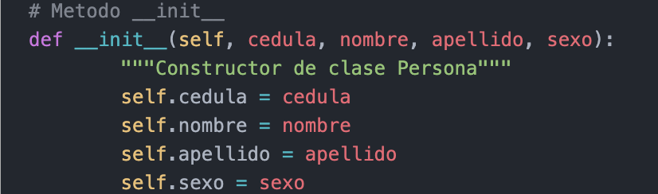

### Ejemplo método init
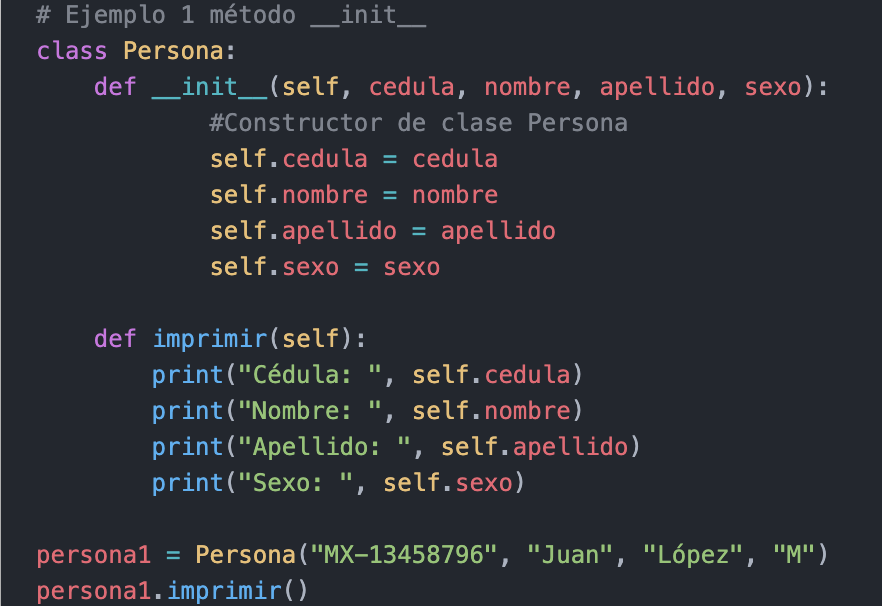

### Salida:
- Cédula:  MX-13458796
- Nombre:  Juan
- Apellido:  López
- Sexo:  M

###### Nota: Dentro del archivo Python_NB10c.py se encuentran 2 ejemplos mas con el método init, ***se necesita ingresar datos***

# Fin del curso básico de ***Python***

#
|  | Descripción |
|-----:|---------------|
|  | ***Documentación oficial*** |
|  | ***Inicio del curso*** |

## Puedes seguir y apoyar mi trabajo haciendo click en "☆ Star" y en el botón de Follow.
## ¡Muchas gracias, bienvenido!!!

## Contacto y apoyo:

 
 

